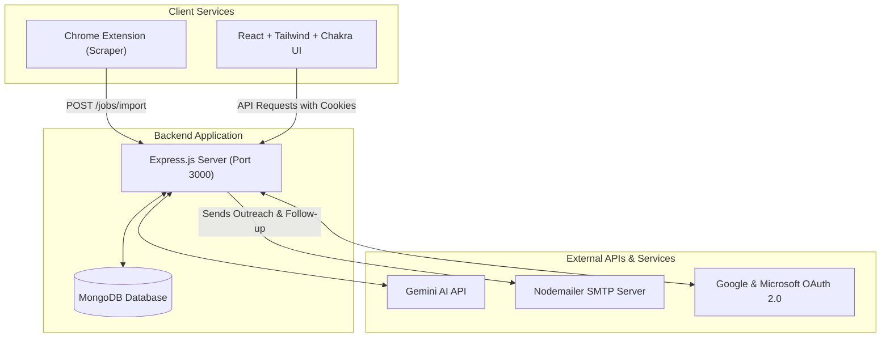

# Job Apply App 🚀

A comprehensive AI-powered job application suite that includes a **Job Tracker**, **AI Cover Letter Generator**, **Resume Parser & Multi-Resume Manager**, **Job Description (JD) Extractor**, **Chrome Extension Scraper**, **Interview Prep Simulator**, and an **Interactive Recruiter Inbox** with AI suggested replies. Powered by Google's **Gemini AI**.

---

## 📊 Architecture Diagram

The diagram below outlines how the client services, the backend server, and external APIs communicate with each other:



---

## ✨ Features

### 🔐 1. Authentication & Profile Settings
* **OAuth Login**: Authenticate securely using Google OAuth 2.0 or Microsoft OAuth 2.0.
* **Session Management**: Cookie-based persistent sessions handled securely via `jaa_session_token`.
* **Profile Settings**: Edit profile details, change email addresses, and upload custom profile pictures (supported by Multer image uploading).

### 📄 2. Resume Builder & Multi-Resume Manager
* **Resume Parsing**: Drag and drop resumes (PDF, DOCX, Images) to automatically parse credentials, skills, work experience, and education using Gemini AI and Tesseract OCR.
* **Resume Editor**: A visual JSON resume builder enabling real-time updates to sections (Education, Experience, Skills, Projects).
* **Multi-Resume Support**: Manage multiple uploaded resumes, delete outdated versions, and choose a **primary resume** to be used dynamically for ATS score matches and outreach content generation.

### 📋 3. Job Tracking Dashboard
* **Clean Modern Interface**: High-performance tabular dashboard displaying all active job tracking cards.
* **Circular ATS Score Rings**: Real-time visual comparison of your primary resume against the job description, showing an ATS score percentage directly in the table.
* **Status Flags**: Track current application status (e.g., *Pending*, *Sent*, *Opened*, *Replied*) dynamically.
* **Inline Actions**: Hover tools to edit or delete applications on the fly.
* **Analytics Panel**: Real-time charts showing application counts, status breakdowns, and response rates.

### 📥 4. Smart Job Import & JD Parsing
* **JD File Extraction**: Drag and drop a Job Description document (PDF, Word, or images like PNG, JPG). The backend automatically parses the text (with OCR backup) and extracts job details (Title, Company, Recruiter Name, Recruiter Email, description text) so you can review them before saving.
* **Chrome Extension Importer**: Scrape job postings directly on live LinkedIn and Indeed listings, sending the details instantly to the database via API.

### ✉️ 5. AI Cover Letter Generator & Outreach
* **Customizable Letter Generation**: Generate letters customized by **Tone** (Professional, Confident, Passionate, etc.) and **Length** (using an interactive word count slider).
* **Email Outreach**: Directly draft and email outreach letters to recruiters with your resume attached, powered by SMTP/Nodemailer settings.
* **DOCX Export**: Download generated cover letters directly as formatted DOCX files.

### 🕵️ 6. Open & Click Tracking
* **Open Tracking Pixel**: Embeds a hidden 1x1 tracking pixel (`/jobs/tracking/open/:id`) in the outreach email body to log when the recruiter opens the email.
* **Click Redirection**: Rewrites links (e.g., to your portfolio or LinkedIn) through a redirect endpoint (`/jobs/tracking/click/:id`) to track when recruiters click links in your email.
* **Automatic Follow-ups**: Sends automated, customized follow-up emails after a specified period if there is no response.

### 🎙️ 7. Interview Prep Simulator
* **AI Question Generator**: Generates 8 tailored interview questions (Technical, Behavioral, and Situational) matching the specific job description and your active resume.
* **Practice Interface**: Write answers directly in a notes scratchpad.
* **AI Grading & Feedback**: Submit answers to receive a grade (1-10), comprehensive critique, and an improved response suggestion.

### 📥 8. Recruiter Inbox & Communications
* **Message Logger**: Log emails, messages, or interview requests received from recruiters.
* **Interactive Chat UI**: A slide-out drawer presenting a thread-style bubble history to keep recruiter discussions organized.
* **AI Suggested Replies**: Auto-generate reply drafts matching the context of the conversation.

---

## 🛠️ Tech Stack

* **Frontend**: React, Vite, Tailwind CSS, Chakra UI, Redux Toolkit, Axios, Framer Motion
* **Backend**: Node.js, Express.js, MongoDB (Mongoose), Multer, Nodemailer, Passport.js, Tesseract.js (OCR)
* **Chrome Extension**: Manifest V3 (JavaScript content scripts & popup panel)
* **AI Engine**: Gemini AI via OpenAI-compatible SDK

---

## 📁 Directory Structure

```text
Job-apply-app/
├── Back-end/
│   ├── controllers/      # Route handler logic
│   ├── middlewares/      # Authentication & file upload middleware
│   ├── models/           # Mongoose schemas (User, Job, Resume)
│   ├── routes/           # Express router endpoints
│   ├── utils/            # Services (Gemini AI, Nodemailer, OAuth, OCR parser)
│   ├── public/           # Static uploads directory (resumes, jd, profile pics)
│   ├── index.js          # Main application entry point
│   └── package.json
├── Front-end/
│   ├── src/
│   │   ├── components/   # Reusable UI parts (ResumeBuilder, JobsTable, etc.)
│   │   ├── redux/        # Redux state slices
│   │   └── App.jsx       # Main router & page assembler
│   └── package.json
└── chrome-extension/
    ├── manifest.json     # Extension setup & permissions
    ├── content.js        # Site scraping scripts for LinkedIn/Indeed
    ├── popup.html        # Interactive extension UI
    └── popup.js          # Scraped data transmitter
```

---

## ⚙️ Environment Variables (`.env`)

Create a `.env` file inside the `Back-end/` directory and populate it with the following configuration:

```env
# Server Port
PORT=3000

# Database
MONGODB_URI=your_mongodb_connection_uri

# Gemini AI API Configuration
GEMINI_API_KEY=your_gemini_api_key

# Nodemailer SMTP Configuration
EMAIL_USER=your_email_address@gmail.com
EMAIL_PASSWORD=your_email_app_password

# Google OAuth2 Credentials (https://console.cloud.google.com)
GOOGLE_CLIENT_ID=your_google_client_id
GOOGLE_CLIENT_SECRET=your_google_client_secret
GOOGLE_REDIRECT_URI=http://localhost:3000/auth/google/callback

# Microsoft OAuth2 Credentials (https://portal.azure.com)
MICROSOFT_CLIENT_ID=your_microsoft_client_id
MICROSOFT_CLIENT_SECRET=your_microsoft_client_secret
MICROSOFT_REDIRECT_URI=http://localhost:3000/auth/microsoft/callback

# Security Keys
SESSION_SECRET=your_session_secret
JWT_SECRET=your_jwt_secret

# Tracking Settings
TRACKING_BASE_URL=http://localhost:3000
```

---

## 🔗 API Endpoints Reference

### 🔐 Authentication (`/auth`)
| Method | Endpoint | Auth | Description |
|:---|:---|:---:|:---|
| `GET` | `/auth/google` | Public | Initiates the Google OAuth 2.0 login flow |
| `GET` | `/auth/google/callback` | Public | Google OAuth redirect handler callback |
| `GET` | `/auth/microsoft` | Public | Initiates the Microsoft OAuth 2.0 login flow |
| `GET` | `/auth/microsoft/callback` | Public | Microsoft OAuth redirect handler callback |
| `GET` | `/auth/status` | Authenticated | Verifies user session and returns profile data |
| `POST` | `/auth/logout` | Public | Logs out user and clears session cookies |
| `POST` | `/auth/profile/update` | Authenticated | Updates user profile and uploads photo (file field: `picture`) |

### 💼 Job Management (`/jobs`)
| Method | Endpoint | Auth | Description |
|:---|:---|:---:|:---|
| `GET` | `/jobs` | Authenticated | Retrieves all tracked job applications |
| `POST` | `/jobs` | Authenticated | Manually adds a new job application |
| `PATCH` | `/jobs/:id` | Authenticated | Updates an existing job application |
| `DELETE` | `/jobs/:id` | Authenticated | Removes a job application |
| `GET` | `/jobs/analytics` | Authenticated | Fetches application counts and response rate analytics |
| `POST` | `/jobs/import` | Authenticated | Imports a scraped job from the Chrome Extension |
| `POST` | `/jobs/extract-jd` | Authenticated | Parses job details from uploaded JD file (file field: `jdFile`) |
| `POST` | `/jobs/:id/upload-jd` | Authenticated | Associates and extracts a JD document for an existing job |
| `POST` | `/jobs/:id/generate-cover-letter` | Authenticated | Generates custom cover letter for the job details |
| `POST` | `/jobs/:id/interview-prep` | Authenticated | Generates 8 tailored interview preparation questions |
| `PATCH` | `/jobs/:id/interview-notes` | Authenticated | Updates practice answers / scratchpad notes for questions |
| `POST` | `/jobs/:id/grade-answer` | Authenticated | Grades a specific practice answer and yields AI suggestions |
| `GET` | `/jobs/:id/messages` | Authenticated | Fetches logged recruiter chat message history |
| `POST` | `/jobs/:id/messages` | Authenticated | Logs a new incoming/outgoing recruiter message |
| `POST` | `/jobs/:id/suggest-reply` | Authenticated | Generates an AI-suggested reply to a recruiter message |

### 📄 Resume Management (Root Mounted)
| Method | Endpoint | Auth | Description |
|:---|:---|:---:|:---|
| `POST` | `/upload-resume` | Authenticated | Uploads and parses a new resume (file field: `resume`) |
| `GET` | `/resume-data` | Authenticated | Retrieves current primary resume data (structured JSON) |
| `POST` | `/export-resume` | Authenticated | Generates and exports primary resume as tailored PDF |
| `POST` | `/preview-template` | Authenticated | Returns HTML template preview of user resume |
| `GET` | `/resume/list` | Authenticated | Retrieves a list of all uploaded resumes |
| `POST` | `/resume/select` | Authenticated | Sets an active primary resume |
| `POST` | `/resume/delete` | Authenticated | Deletes a specific resume |
| `PUT` | `/resume/update` | Authenticated | Directly updates structured JSON sections of active resume |
| `POST` | `/resume/ats-score` | Authenticated | Computes match percentage between resume and JD text |
| `POST` | `/resume/cover-letter` | Authenticated | Generates general cover letter based on active resume |
| `POST` | `/resume/cover-letter/export` | Authenticated | Exports cover letter to DOCX file format |
| `POST` | `/resume/tailor` | Authenticated | Optimizes resume data for a specific JD to match ATS criteria |

### ✉️ Email & Tracking (Root Mounted)
| Method | Endpoint | Auth | Description |
|:---|:---|:---:|:---|
| `POST` | `/apply` | Authenticated | Sends recruiter outreach email via SMTP with resume attached |
| `GET` | `/emails/replies` | Authenticated | Scrapes inbound inbox replies from recruiter |
| `POST` | `/apply/follow-up` | Authenticated | Sends an automated follow-up email if recruiter is unresponsive |
| `GET` | `/jobs/tracking/open/:id` | Public | 1x1 image tracker to log email opens |
| `GET` | `/jobs/tracking/click/:id` | Public | Logs link click redirection activity |

---

## 🚀 Installation & Setup

### 📋 Prerequisites
* **Node.js** (v18.0.0 or higher)
* **MongoDB** (Local instance or MongoDB Atlas URI)
* **Gemini API Key** (or compatible OpenAI keys)

---

### 1️⃣ Step 1: Run the Backend
Navigate into the `Back-end` directory and initialize the server:

```bash
# Go to Back-end folder
cd Back-end

# Install dependencies
npm install

# Create/Update .env variables
# Copy configuration sample from environment section above into .env

# Run the server in development mode
npm start
```
*The server will boot up at **`http://localhost:3000`**.*

---

### 2️⃣ Step 2: Run the Frontend
Open a new terminal session, navigate to the `Front-end` folder, and initialize Vite:

```bash
# Go to Front-end folder
cd Front-end

# Install dependencies
npm install

# Run the React application
npm run dev
```
*The React app will boot up at **`http://localhost:5173`**.*

> [!WARNING]
> Running `npm run dev` directly from the project root will fail. You must navigate to the `Front-end` directory first.

---

### 3️⃣ Step 3: Install the Chrome Extension
1. Open Google Chrome and navigate to `chrome://extensions/`.
2. Turn on **Developer Mode** using the toggle in the upper-right corner.
3. Click on the **Load unpacked** button in the upper-left corner.
4. Select the `chrome-extension/` directory of this repository.
5. Pins the extension to your browser toolbar. Refresh active LinkedIn or Indeed pages to allow the scraper script to load.

---

## 🤝 Troubleshooting & Tips

* **Tesseract OCR**: When uploading an image version of a resume or JD, the backend uses Tesseract.js. It requires `eng.traineddata` (located in the backend root directory) to correctly extract English language characters.
* **CORS Settings**: The backend allows requests from `http://localhost:5173`, `http://localhost:5174`, `http://localhost:4173`, and Chrome Extensions (`chrome-extension://`). If you configure different local ports, make sure to add them to `index.js`.
* **OAuth Redirection**: Make sure redirect URIs are configured correctly in the Google Cloud Console and Azure Portal matching the values inside your backend `.env`.
