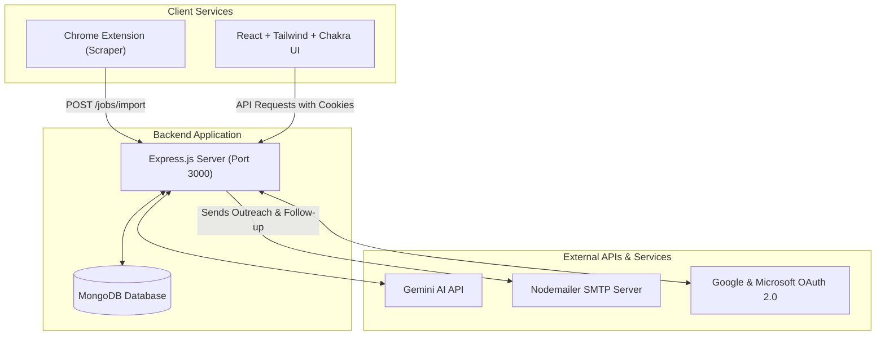

# Job Apply App 🚀

A comprehensive AI-powered job application suite that includes a **Job Tracker**, **AI Cover Letter Generator**, **Resume Parser & Multi-Resume Manager**, **Job Description (JD) Extractor**, **Chrome Extension Scraper**, **Interview Prep Simulator**, and an **Interactive Recruiter Inbox** with AI suggested replies. Powered by Google's **Gemini AI**.

---

## 📊 Architecture Diagram

The diagram below outlines how the client services, the backend server, and external APIs communicate with each other:



---

## ✨ Features

### 🔐 1. Authentication & Profile Settings
* **Secure OAuth 2.0 Integration**: Supports fast and secure single sign-on (SSO) using Google and Microsoft OAuth providers. Passwords are never stored or managed locally.
* **Persistent Session Management**: Uses secure HTTP-only cookies (`jaa_session_token`) infused with JSON Web Tokens (JWT) to maintain authenticated sessions across browser restarts without exposing tokens to client-side scripts.
* **Profile Customization**: Users can seamlessly update their personal information, preferred email signatures, and upload profile pictures. Profile pictures are processed and securely stored locally using Multer.

### 📄 2. Resume Builder & Multi-Resume Manager
* **Intelligent Resume Parsing**: Users can drag and drop their existing resumes in multiple formats (PDF, DOCX, PNG, JPG). The backend leverages Gemini AI to extract structured JSON data (Experience, Education, Skills) and falls back to Tesseract OCR for image-based documents.
* **WYSIWYG A4 Resume Editor**: A powerful inline visual editor built directly onto physically-scaled A4 pages. Features a smart, React-driven page-break engine that automatically flows sections to new pages without cutting them in half, ensuring the on-screen display perfectly mirrors the generated PDF. Click any section to reveal inline tools to edit, delete, or re-order content directly on the page.
* **Real-time Auto-Save**: Any changes made in the visual editor are instantly captured in local state and automatically debounced (saved to the database after 1-2 seconds of inactivity), completely eliminating the need for a manual "Save" button.
* **Multiple Layout Templates**: Switch instantly between aesthetic designs (Classic, Modern, Minimal) without losing any resume data. The JSON structure remains decoupled from the visual presentation layer.
* **Multi-Resume Management**: Upload, generate, and store multiple distinct versions of a resume for different industries. Select a specific "Primary Resume" that acts as the source-of-truth when generating ATS scores and cover letters.
* **PDF & DOCX Exports**: Export beautifully formatted PDFs generated via headless browser (Puppeteer) or fully editable DOCX files.

### 📋 3. Job Tracking Dashboard
* **Centralized Job Board**: A high-performance, tabular interface that cleanly organizes all applied jobs, current statuses, and target companies.
* **Dynamic Status Workflow**: Track job progression through customizable tags (*Pending*, *Sent*, *Opened*, *Replied*, *Interviewing*, *Rejected*).
* **Circular ATS Score Rings**: Automatically computes an ATS match percentage by analyzing your primary resume against the saved Job Description. Displays a color-coded circular progress ring directly on the dashboard.
* **Analytics Panel**: Real-time chart visualization showing funnel drop-offs (e.g., Applications Sent vs. Interviews Secured) and overall response rates to help optimize job hunting strategies.

### 📥 4. Smart Job Import & JD Parsing
* **JD File Extraction**: Drag and drop a Job Description document. The backend automatically parses the text and uses AI to extract key metadata: Job Title, Company Name, Recruiter Name, Recruiter Email, and the core responsibilities.
* **Chrome Extension Importer**: A Manifest V3 Chrome Extension that lives in the browser. While browsing job boards like LinkedIn or Indeed, a single click scrapes the active job posting and beams it directly into the application's database via a secure REST API.

### ✉️ 5. AI Cover Letter Generator & Outreach
* **Context-Aware Letter Generation**: By combining the active Job Description with the user's Primary Resume, the AI drafts highly personalized cover letters that explicitly map the user's past experience to the employer's requirements.
* **Tone & Length Sliders**: Customize the generated letter's tone (Professional, Confident, Passionate) and strictly control word count using an interactive length slider.
* **Direct Email Outreach**: Send the generated cover letter and automatically attach the primary PDF resume directly to the recruiter's inbox using the built-in SMTP/Nodemailer engine.

### 🕵️ 6. Open & Click Tracking
* **Open Tracking Pixel**: When sending outreach emails, the system injects a hidden 1x1 tracking pixel (`/jobs/tracking/open/:id`). When the recruiter opens the email, the dashboard instantly updates the status to *Opened*.
* **Click Redirection Engine**: Automatically wraps portfolio and LinkedIn links inside the email with a secure redirect endpoint (`/jobs/tracking/click/:id`). Logs exactly when and which links the recruiter clicked.
* **Automated Follow-ups**: If an email is sent but receives no reply within a configured timeframe, the system can automatically draft and send a polite follow-up email.

### 🎙️ 7. Interview Prep Simulator
* **AI Question Generator**: Analyzes the specific Job Description and generates 8 highly relevant interview questions categorized into Technical, Behavioral, and Situational buckets.
* **Interactive Practice Interface**: A built-in scratchpad allows users to type out their answers under simulated pressure.
* **AI Grading & Feedback Loop**: Upon submitting an answer, the AI grades it on a scale of 1-10, provides a comprehensive critique on what was missing, and offers a polished, "perfect" response suggestion.

### 📥 8. Recruiter Inbox & Communications
* **Message Logger**: A centralized hub to manually log or automatically capture email threads, LinkedIn messages, and interview requests.
* **Interactive Chat UI**: A slide-out drawer presenting a thread-style, iMessage-like bubble history to keep recruiter discussions historically organized.
* **AI Suggested Replies**: Context-aware AI reads the latest recruiter message and auto-generates professional reply drafts (e.g., accepting an interview slot, negotiating salary, or asking for feedback).

---

## 🛠️ Tech Stack

* **Frontend**: React, Vite, Tailwind CSS, Chakra UI, Redux Toolkit, Axios, Framer Motion
* **Backend**: Node.js, Express.js, MongoDB (Mongoose), Multer, Nodemailer, Passport.js, Tesseract.js (OCR)
* **Chrome Extension**: Manifest V3 (JavaScript content scripts & popup panel)
* **AI Engine**: Gemini AI via OpenAI-compatible SDK

---

## 📁 Directory Structure

```text
Job-apply-app/
├── Back-end/
│   ├── controllers/      # Route handler logic
│   ├── middlewares/      # Authentication & file upload middleware
│   ├── models/           # Mongoose schemas (User, Job, Resume)
│   ├── routes/           # Express router endpoints
│   ├── utils/            # Services (Gemini AI, Nodemailer, OAuth, OCR parser)
│   ├── public/           # Static uploads directory (resumes, jd, profile pics)
│   ├── index.js          # Main application entry point
│   └── package.json
├── Front-end/
│   ├── src/
│   │   ├── components/   # Reusable UI parts (ResumeBuilder, JobsTable, etc.)
│   │   ├── redux/        # Redux state slices
│   │   └── App.jsx       # Main router & page assembler
│   └── package.json
└── chrome-extension/
    ├── manifest.json     # Extension setup & permissions
    ├── content.js        # Site scraping scripts for LinkedIn/Indeed
    ├── popup.html        # Interactive extension UI
    └── popup.js          # Scraped data transmitter
```

---

## ⚙️ Environment Variables (`.env`)

Create a `.env` file inside the `Back-end/` directory and populate it with the following configuration:

```env
# Server Port
PORT=3000

# Database
MONGODB_URI=your_mongodb_connection_uri

# Gemini AI API Configuration
GEMINI_API_KEY=your_gemini_api_key

# Nodemailer SMTP Configuration
EMAIL_USER=your_email_address@gmail.com
EMAIL_PASSWORD=your_email_app_password

# Google OAuth2 Credentials (https://console.cloud.google.com)
GOOGLE_CLIENT_ID=your_google_client_id
GOOGLE_CLIENT_SECRET=your_google_client_secret
GOOGLE_REDIRECT_URI=http://localhost:3000/auth/google/callback

# Microsoft OAuth2 Credentials (https://portal.azure.com)
MICROSOFT_CLIENT_ID=your_microsoft_client_id
MICROSOFT_CLIENT_SECRET=your_microsoft_client_secret
MICROSOFT_REDIRECT_URI=http://localhost:3000/auth/microsoft/callback

# Security Keys
SESSION_SECRET=your_session_secret
JWT_SECRET=your_jwt_secret

# Tracking Settings
TRACKING_BASE_URL=http://localhost:3000
```

---

## 🔗 API Endpoints Reference

### 🔐 Authentication (`/auth`)
| Method | Endpoint | Auth | Description |
|:---|:---|:---:|:---|
| `GET` | `/auth/google` | Public | Initiates the Google OAuth 2.0 login flow |
| `GET` | `/auth/google/callback` | Public | Google OAuth redirect handler callback |
| `GET` | `/auth/microsoft` | Public | Initiates the Microsoft OAuth 2.0 login flow |
| `GET` | `/auth/microsoft/callback` | Public | Microsoft OAuth redirect handler callback |
| `GET` | `/auth/status` | Authenticated | Verifies user session and returns profile data |
| `POST` | `/auth/logout` | Public | Logs out user and clears session cookies |
| `POST` | `/auth/profile/update` | Authenticated | Updates user profile and uploads photo (file field: `picture`) |

### 💼 Job Management (`/jobs`)
| Method | Endpoint | Auth | Description |
|:---|:---|:---:|:---|
| `GET` | `/jobs` | Authenticated | Retrieves all tracked job applications |
| `POST` | `/jobs` | Authenticated | Manually adds a new job application |
| `PATCH` | `/jobs/:id` | Authenticated | Updates an existing job application |
| `DELETE` | `/jobs/:id` | Authenticated | Removes a job application |
| `GET` | `/jobs/analytics` | Authenticated | Fetches application counts and response rate analytics |
| `POST` | `/jobs/import` | Authenticated | Imports a scraped job from the Chrome Extension |
| `POST` | `/jobs/extract-jd` | Authenticated | Parses job details from uploaded JD file (file field: `jdFile`) |
| `POST` | `/jobs/:id/upload-jd` | Authenticated | Associates and extracts a JD document for an existing job |
| `POST` | `/jobs/:id/generate-cover-letter` | Authenticated | Generates custom cover letter for the job details |
| `POST` | `/jobs/:id/interview-prep` | Authenticated | Generates 8 tailored interview preparation questions |
| `PATCH` | `/jobs/:id/interview-notes` | Authenticated | Updates practice answers / scratchpad notes for questions |
| `POST` | `/jobs/:id/grade-answer` | Authenticated | Grades a specific practice answer and yields AI suggestions |
| `GET` | `/jobs/:id/messages` | Authenticated | Fetches logged recruiter chat message history |
| `POST` | `/jobs/:id/messages` | Authenticated | Logs a new incoming/outgoing recruiter message |
| `POST` | `/jobs/:id/suggest-reply` | Authenticated | Generates an AI-suggested reply to a recruiter message |

### 📄 Resume Management (Root Mounted)
| Method | Endpoint | Auth | Description |
|:---|:---|:---:|:---|
| `POST` | `/upload-resume` | Authenticated | Uploads and parses a new resume (file field: `resume`) |
| `GET` | `/resume-data` | Authenticated | Retrieves current primary resume data (structured JSON) |
| `POST` | `/export-resume` | Authenticated | Generates and exports primary resume as tailored PDF |
| `POST` | `/preview-template` | Authenticated | Returns HTML template preview of user resume |
| `GET` | `/resume/list` | Authenticated | Retrieves a list of all uploaded resumes |
| `POST` | `/resume/select` | Authenticated | Sets an active primary resume |
| `POST` | `/resume/delete` | Authenticated | Deletes a specific resume |
| `PUT` | `/resume/update` | Authenticated | Directly updates structured JSON sections of active resume |
| `POST` | `/resume/ats-score` | Authenticated | Computes match percentage between resume and JD text |
| `POST` | `/resume/cover-letter` | Authenticated | Generates general cover letter based on active resume |
| `POST` | `/resume/cover-letter/export` | Authenticated | Exports cover letter to DOCX file format |
| `POST` | `/resume/tailor` | Authenticated | Optimizes resume data for a specific JD to match ATS criteria |

### ✉️ Email & Tracking (Root Mounted)
| Method | Endpoint | Auth | Description |
|:---|:---|:---:|:---|
| `POST` | `/apply` | Authenticated | Sends recruiter outreach email via SMTP with resume attached |
| `GET` | `/emails/replies` | Authenticated | Scrapes inbound inbox replies from recruiter |
| `POST` | `/apply/follow-up` | Authenticated | Sends an automated follow-up email if recruiter is unresponsive |
| `GET` | `/jobs/tracking/open/:id` | Public | 1x1 image tracker to log email opens |
| `GET` | `/jobs/tracking/click/:id` | Public | Logs link click redirection activity |

### 📖 Swagger API Documentation
An interactive Swagger UI is built into the backend to view detailed API paths, parameters, schemas, and live test payload examples.
* **Swagger Documentation URL**: `http://localhost:3000/api-docs`
* **Raw OpenAPI Specification JSON**: `http://localhost:3000/openapi.json`

---

## 🚀 Installation & Setup

### 📋 Prerequisites
* **Node.js** (v18.0.0 or higher)
* **MongoDB** (Local instance or MongoDB Atlas URI)
* **Gemini API Key** (or compatible OpenAI keys)

---

### 1️⃣ Step 1: Run the Backend
Navigate into the `Back-end` directory and initialize the server:

```bash
# Go to Back-end folder
cd Back-end

# Install dependencies
npm install

# Create/Update .env variables
# Copy configuration sample from environment section above into .env

# Run the server in development mode
npm start
```
*The server will boot up at **`http://localhost:3000`**.*

---

### 2️⃣ Step 2: Run the Frontend
Open a new terminal session, navigate to the `Front-end` folder, and initialize Vite:

```bash
# Go to Front-end folder
cd Front-end

# Install dependencies
npm install

# Run the React application
npm run dev
```
*The React app will boot up at **`http://localhost:5173`**.*

> [!WARNING]
> Running `npm run dev` directly from the project root will fail. You must navigate to the `Front-end` directory first.

---

### 3️⃣ Step 3: Install the Chrome Extension
1. Open Google Chrome and navigate to `chrome://extensions/`.
2. Turn on **Developer Mode** using the toggle in the upper-right corner.
3. Click on the **Load unpacked** button in the upper-left corner.
4. Select the `chrome-extension/` directory of this repository.
5. Pins the extension to your browser toolbar. Refresh active LinkedIn or Indeed pages to allow the scraper script to load.

---

### 🧪 Running Tests
The suite includes isolated unit and integration tests for both frontend and backend to check schema validation, regex escaping, and helper logic.
* **Backend Tests**: Run the following from the `Back-end` directory:
  ```bash
  node --test tests/*.test.js
  ```
* **Frontend Tests**: Run the following from the `Front-end` directory:
  ```bash
  node --test src/tests/*.test.js
  ```

---

## 🤝 Troubleshooting & Tips

* **Tesseract OCR**: When uploading an image version of a resume or JD, the backend uses Tesseract.js. It requires `eng.traineddata` (located in the backend root directory) to correctly extract English language characters.
* **CORS Settings**: The backend allows requests from `http://localhost:5173`, `http://localhost:5174`, `http://localhost:4173`, and Chrome Extensions (`chrome-extension://`). If you configure different local ports, make sure to add them to `index.js`.
* **OAuth Redirection**: Make sure redirect URIs are configured correctly in the Google Cloud Console and Azure Portal matching the values inside your backend `.env`.
