# Job Apply Application - System Architecture and Functional Flows

This document details the system architecture, component relationships, data flow models, and step-by-step transaction logs for each major feature of the Job Apply Application.

---

## 1. High-Level Architecture Diagram

The system follows a decoupled client-server architecture with external service integrations.

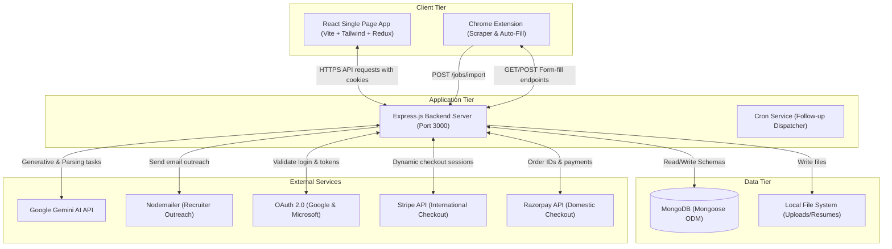

---

## 2. Core Backend Architecture Components

### Security and Sessions
* **Passport.js & OAuth 2.0**: Manages token exchanges with Google and Microsoft.
* **HTTP-Only Cookies**: JWT is stored securely in the browser's `jaa_session_token` cookie. The cookie is flag-hardened (`httpOnly: true`, `secure: true`, `sameSite: 'Lax'`) to shield the session against Cross-Site Scripting (XSS) attacks.
* **AES-256-GCM Encryption**: Implemented in `encryptionService.js` using Node's crypto library. Symmetrically encrypts payment API secrets in MongoDB using a 32-byte hex `ENCRYPTION_KEY`.

### Middlewares
* `authMiddleware.js`: Extract JWT from cookie, verify signatures, populate `req.user`, enforce RBAC (Role-Based Access Control) for admin/owner endpoints.
* `countryMiddleware.js`: Geolocates request origin based on incoming headers (`CF-IPCountry`, `X-Country-Code`, or body override) to serve regional configurations.
* `rateLimiter.js`: Enforces global limits on APIs and dedicated transaction counts on resource-heavy Gemini AI routes.
* `subscriptionMiddleware.js`: Intercepts user requests to check usage quotas (e.g., job limits, AI credits) based on their subscription tier (Free vs. Pro).

---

## 3. Detailed Functional Flows

Here is the step-by-step transaction flow from the User Interface (Frontend) to the Server and Database (Backend) for each functionality.

### 3.1 Authentication and Onboarding Flow

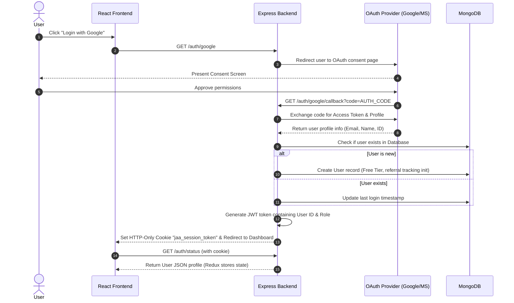

---

### 3.2 Resume Parser and Builder Flow

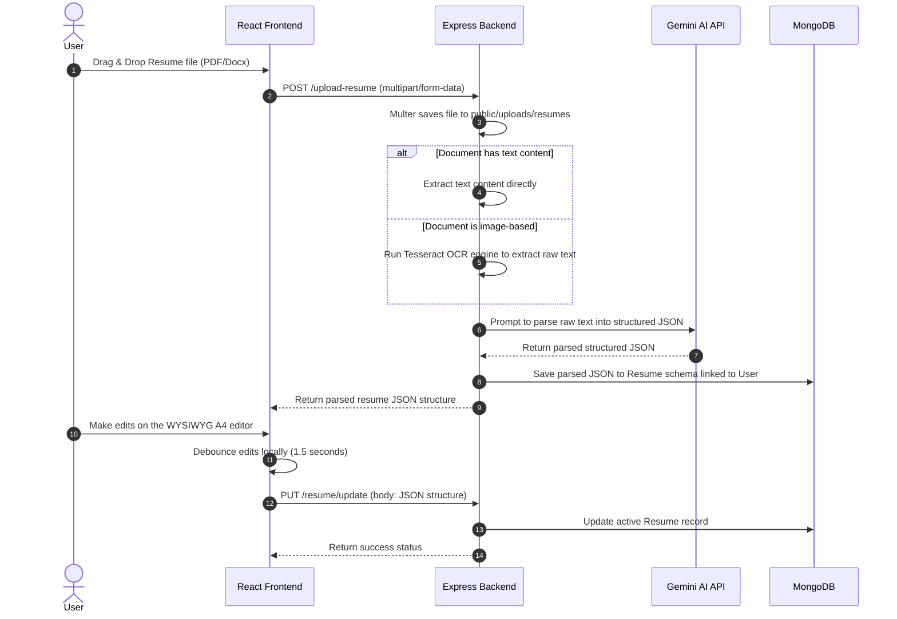

---

### 3.3 Job Scraper and JD Extractor Flow

This handles two ingress paths: dragging/dropping a JD document in the app, or scraping a job using the Chrome Extension on third-party job boards.

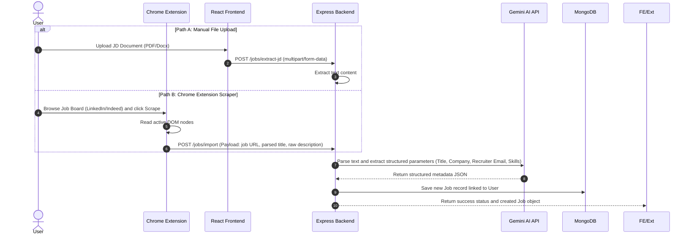

---

### 3.4 ATS Match Scoring Flow

Calculates the matching index of the applicant's primary resume against a specific job description.

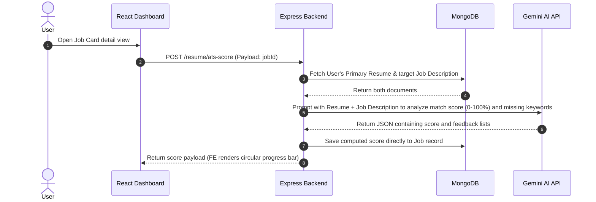

---

### 3.5 Email Outreach with Open and Click Tracking Flow

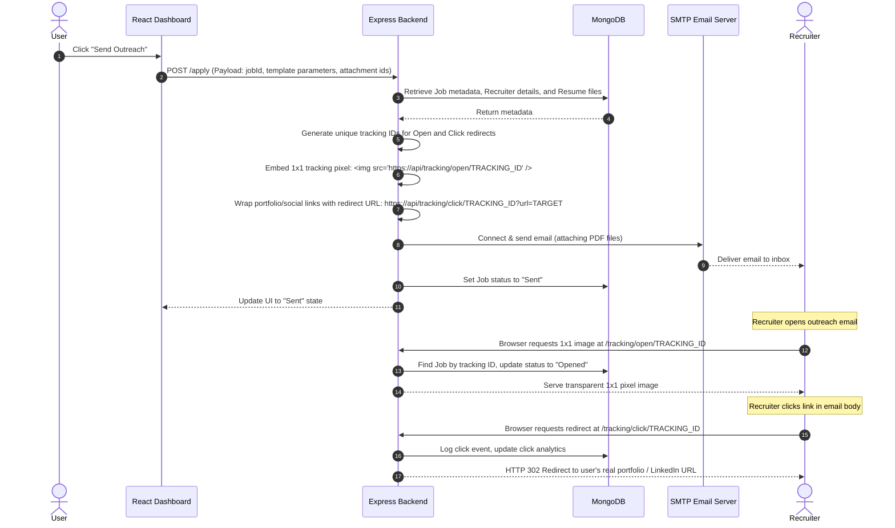

---

### 3.6 Recruiter Inbox and AI Suggested Replies Flow

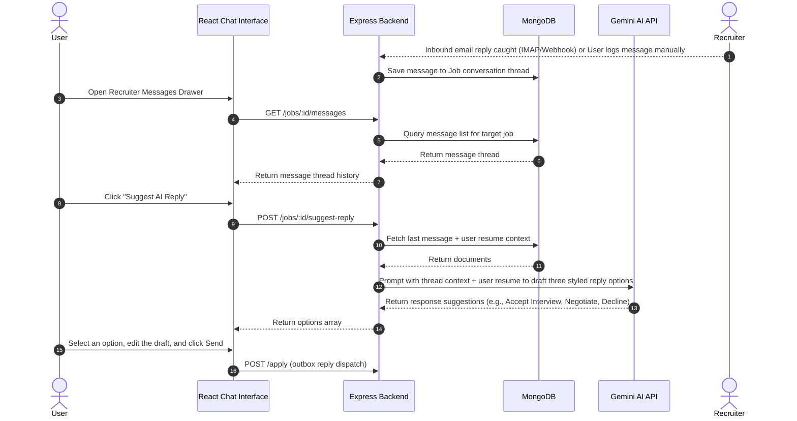

---

### 3.7 Interactive Interview Simulator Flow

Covers both written practice prep and speech-based audio grading.

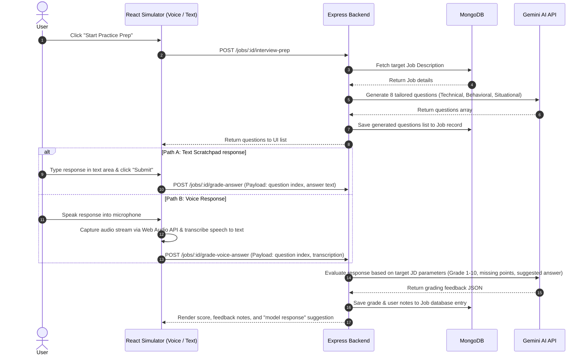

---

### 3.8 Payment Routing and Dynamic Checkout Flow

Demonstrates the geolocation-aware gateway router resolving Stripe vs. Razorpay, and decryption of credentials.

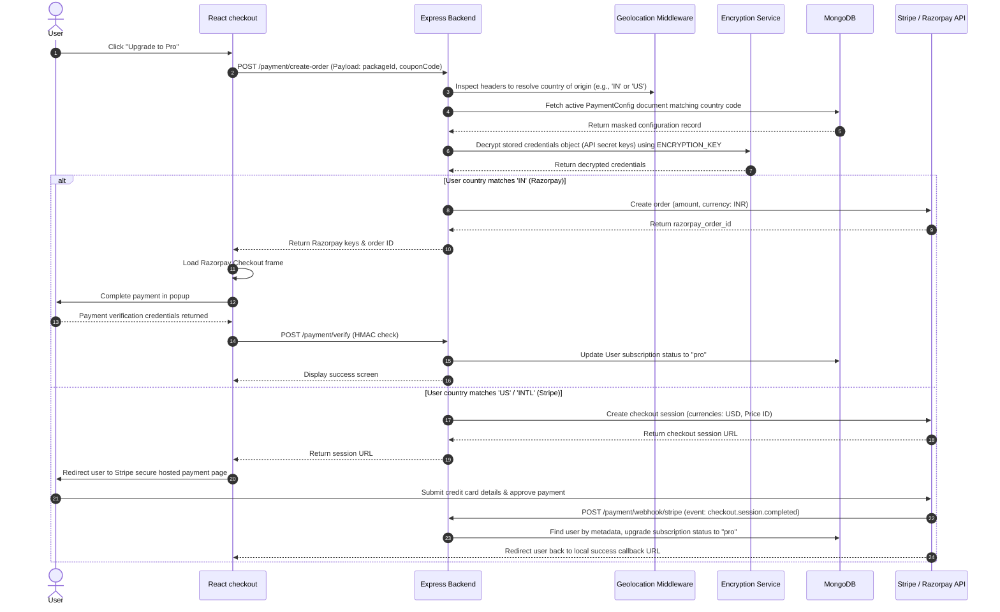

---

### 3.9 System Administration and Configuration Flow

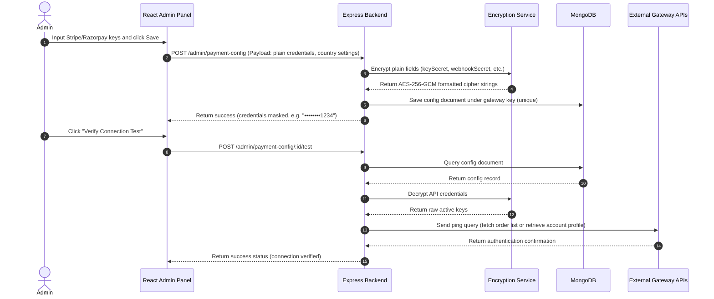

### 3.10 Unified Multi-Provider AI Settings and Fallback Flow

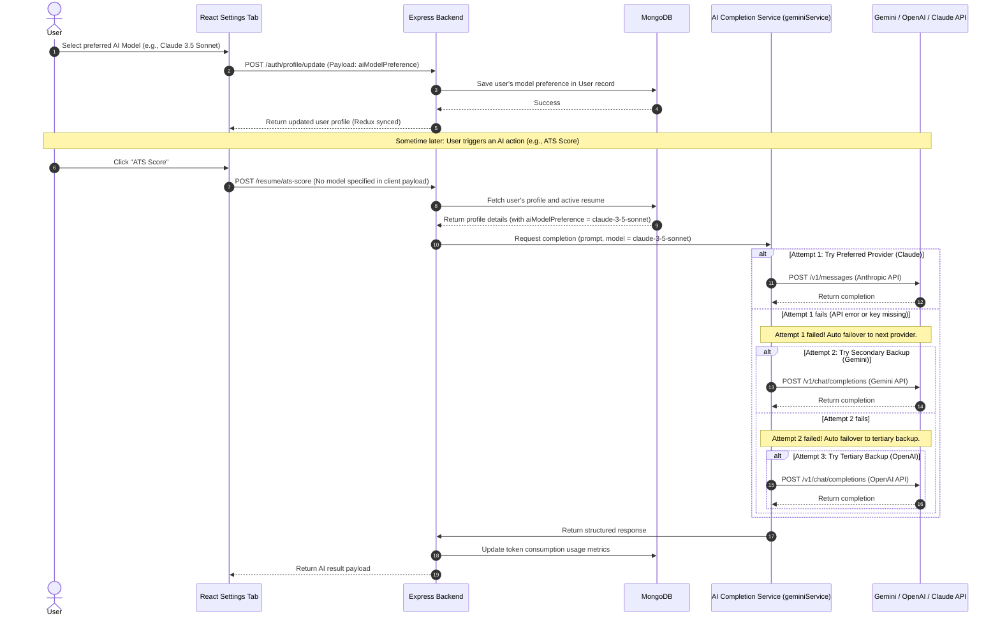

---

## 4. Database Schema Relationships

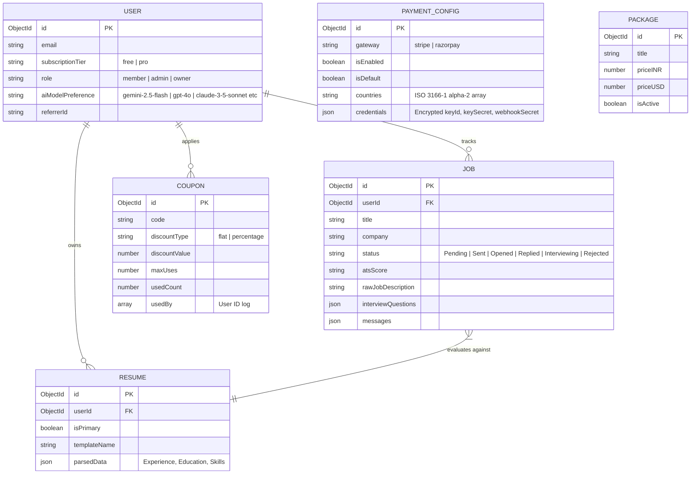
